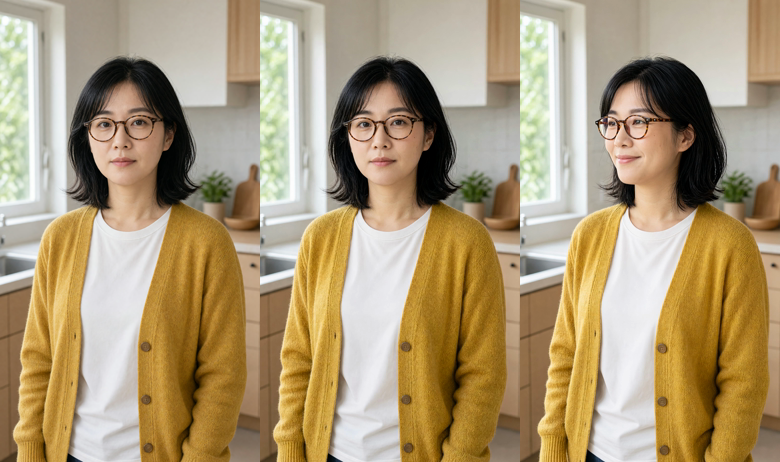
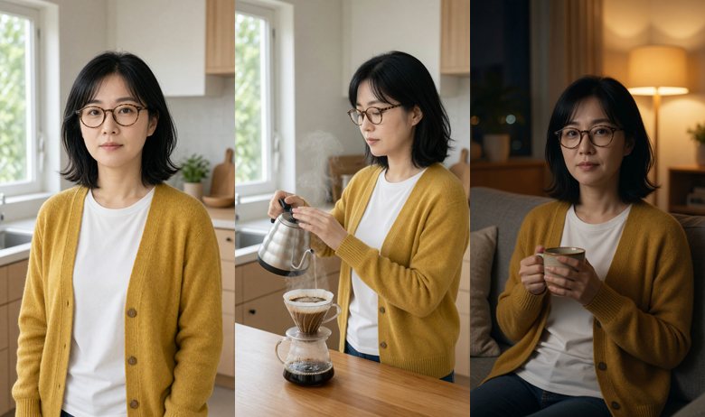
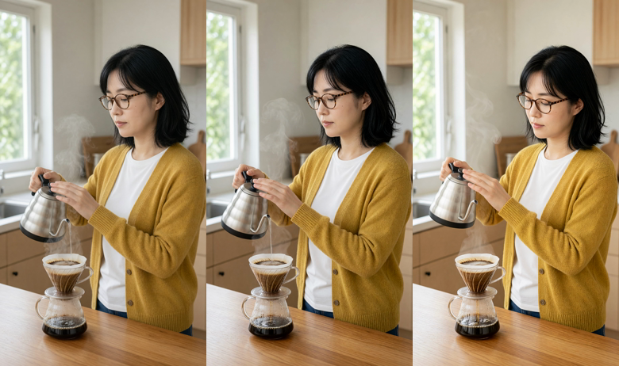

# 고도화 로드맵

**2026-08-17** 기준. Grok(grok-4.6 + 웹/X 검색)과 별도 웹 조사를 교차 검증해 만들었다.
Grok 원문은 [docs/research/grok-2026-08-17.md](research/grok-2026-08-17.md).

## 이 문서의 규칙

모든 주장에 표기를 단다. 조사 중 마케팅 블로그발 수치가 다수 섞여 나왔고, 그대로 믿었다면
근거 없는 KPI를 박제할 뻔했다.

- **[확인됨]** — 1차 출처(공식 문서, 논문, 저장소, 직접 실측)로 확인
- **[미확인]** — 그럴듯하지만 1차 출처를 못 찾음
- **[추측]** — 근거 없는 판단. 실행 전에 직접 재봐야 함

---

> **J절의 실험 3개는 실행 완료됐다.** 셋 다 통과했고, 그 결과가 트랙 1의 구조를 바꿨으며
> 현재 코드의 버그(자막이 목소리보다 0.6초 빠름)를 하나 찾아냈다. 결론부터 보려면 J절로.

## A. 현재 위치

### 실제 약점 (코드 기준)

| 약점 | 근거 |
|---|---|
| 씬마다 인물·장소·톤이 따로 논다 | 씬별 독립 text-to-video (`avs/stages/s3_clips.py`) |
| 720p 소스를 1080 캔버스로 업스케일 | `avs/media/normalize.py` 의 `flags=lanczos` |
| 자막이 문장 단위 | `avs/media/subtitles.py` — 씬당 한 덩어리 |
| ~~자막이 목소리보다 0.6초 빠름~~ | J절에서 발견, **2026-08-17 수정 완료** |
| 컷 편집이 없음 | 씬 = 클립 1:1. 화면 안 움직임도 없음 |
| 배경음악 없음 | `avs/media/mix.py` 는 내레이션 + 환경음만 |
| ~~훅 구조가 없음~~ | 구성안 `## 훅` + s2 규칙 8로 강제. **2026-08-20 수정 완료** |
| ~~대본 문체 기준이 없음~~ | `avs/quality.py` + `avs lint`. **2026-08-20 수정 완료** |
| 업로드·성과 수집 없음 | `s6_ingest.py` 가 파이프라인의 끝 |

### 비교 대상보다 이미 나은 것

버리면 안 되는 자산이다. 대부분의 OSS 대안은 스톡 영상을 쓰기 때문에 아래 문제를
**풀지 않고 회피**한 것이다.

- 내레이션 실측 길이가 씬 길이를 정하는 2-pass (`avs/media/timeline.py`)
- 한국어 숫자 낭독 정규화 (`avs/tts/normalize_text.py`) — 실측으로 필요성 확인
- 스테이지·씬 단위 멱등 재개 (`avs/state.py`, `manifest.json`)
- 사이드체인 더킹 + loudnorm −14 LUFS (`avs/media/mix.py`)
- 자막이 씬이 아니라 **목소리 구간**에 붙음
- Grok 9:16 네이티브 요청 (크롭으로 화면을 버리지 않음)

---

## B. 트랙 1 — 시각 일관성 (최우선)

지금 결과물의 가장 큰 결함이다. 5개 씬이 각각 다른 사람, 다른 부엌, 다른 톤으로 나온다.

### 핵심 전환: text-to-video → 키프레임 이미지 → image-to-video

**[확인됨]** xAI 공식 문서:
> "On `grok-imagine-video-1.5`, image-to-video supports native 1080p."
> — https://docs.x.ai/developers/model-capabilities/video/image-to-video

이 한 줄이 두 가지 약점을 동시에 없앤다. **일관성과 해상도가 같은 변경으로 해결된다.**
지금의 lanczos 업스케일이 통째로 불필요해진다.

### 3단 구조 — J절 실험으로 검증 및 수정됨

```
1. 캐릭터 스틸 1장          /images/generations  (2k, 9:16)
2. 씬별 스틸               /images/edits        (1을 소스로 → 인물 고정, 720p 출력)
3. 씬별 클립               /videos/generations  (2를 image 로 → resolution=1080p → 1088x1920)
```

**일관성은 이미지 단계에서, 해상도는 영상 단계에서** 얻는다. 영상 단계의
reference-to-video로 둘을 동시에 얻으려던 초안은 **틀렸다** — API가 1080p를 거부한다(J절).

프롬프트는 장면 묘사가 아니라 **동작과 카메라만** 담게 바뀐다. 구도·인물·조명은 이미지가 정한다.

4단계로 직전 클립의 마지막 프레임을 다음 씬의 입력으로 체인하는 건 **[추측 — 미검증]**.
씬별 스틸을 캐릭터 스틸에서 각각 뽑는 것만으로도 실험 2에서 일관성이 유지됐으므로,
체인이 추가로 필요한지는 확인이 더 필요하다.

### 캐릭터 바이블

**[확인됨]** `reference_images` 는 공식 기능 —
https://docs.x.ai/developers/model-capabilities/video/reference-to-video

에피소드마다 턴어라운드 2~4장(정면/측면/전신/의상)을 먼저 고정하고, **이미지 편집 단계에서**
소스로 물린다. 프롬프트에는 "same jacket zipper" 급의 불변 디테일을 명시한다.

- **[확인됨]** Hermes 플러그인 코드에 `MAX_REFERENCE_IMAGES = 7`
- **[확인됨]** reference-to-video는 **1080p를 지원하지 않는다** (API가 명시적으로 거부, J절)
- **[미확인]** 공식 문서는 레퍼런스 최대 개수를 명시하지 않고 예시에 3장만 보인다

### 이미 우리 손에 있는 것 — 새 의존성 0

Hermes의 xAI **image_gen** 프로바이더가 이미 설치돼 있고, 영상 쪽과 같은 브리지 패턴으로
부를 수 있다.

```python
XAIImageGenProvider().generate(prompt, aspect_ratio, image_url=…, reference_image_urls=…)
# → 결과에 files-cdn public_url 포함
```

이 `public_url` 을 그대로 영상 생성의 `image` / `reference_images` 입력으로 넘기면 된다.
영상 프로바이더는 로컬 파일도 data URI로 바꿔 받으므로 저장소가 꺼져 있어도 동작한다.

### 구현상 장애물 — Hermes 플러그인의 720p 클램프

**[확인됨]** `plugins/video_gen/xai/__init__.py`:

```python
VALID_RESOLUTIONS = {"480p", "720p"}
...
if normalized_resolution not in VALID_RESOLUTIONS:
    normalized_resolution = DEFAULT_RESOLUTION   # 720p로 조용히 강등
```

1080p를 넘겨도 말없이 720p가 된다. 우회하려면 브리지(`avs/backends/hermes_runner.py`)에서
플러그인을 거치지 않고 `/v1/videos/generations` 를 직접 호출해야 한다. 자격증명 해석
(`tools.xai_http.resolve_xai_http_credentials`)만 재사용하면 되므로 어렵지 않다.

### 비용

씬당 호출이 2배가 된다(이미지 1 + 영상 1). 이미지는 영상보다 훨씬 빠르고 싸다.
**[추측]** 실패 컷 재생성이 줄어 일부 상쇄될 수 있다 — 측정 필요.

**[확인됨]** 1.5 프리뷰 가격은 출력 초당 약 $0.08 + 입력 과금 —
https://docs.x.ai/developers/models/grok-imagine-video-1.5-preview
(우리는 슈퍼그록 OAuth 경유라 구독으로 커버된다)

---

## C. 트랙 2 — 단어 단위 자막

말하는 단어만 강조되는 쇼츠 표준 자막. 지금은 씬당 한 덩어리가 통째로 떠 있다.

### 전제 조건은 이미 충족돼 있다 — 이번 조사 중 직접 실측

Hermes venv에 이미 있는 `faster-whisper` 로 기존 내레이션에 `word_timestamps=True` 를 켰다.
**3.73초 오디오에 1.38초, 어절 5개**:

```
0.00-1.24  30초에서
1.24-1.64  1분
1.64-2.08  시키면
2.08-2.56  90도
2.56-2.94  초반
```

한국어는 어절이 공백으로 나뉘어 카라오케 단위로 그대로 쓸 수 있다. **[확인됨 — 직접 실행]**

### 다만 이건 ASR이지 정렬이 아니다

위 결과의 「시키면」은 원문이 「식히면」이다. 모델이 *들은* 말이지 우리가 *쓴* 말이 아니다.
우리는 정답 텍스트를 갖고 있으므로 필요한 건 ASR이 아니라 **forced alignment** 다.

**후보: Qwen3-ForcedAligner-0.6B** — **J절에서 직접 돌려 통과 확인**
- (audio, transcript) 쌍에서 단어/글자 타임스탬프
- 한국어 포함 11개 언어, 5분 길이까지
- https://huggingface.co/Qwen/Qwen3-ForcedAligner-0.6B · https://arxiv.org/html/2601.21337v1
- **[확인됨 — 직접 실행]** 우리 내레이션 5개 전부 정렬 성공, CPU에서 클립당 0.35초
- **[확인됨 — 직접 실행]** 한국어에는 `soynlp` 와 `librosa` 가 추가로 필요하다.
  모델 카드에 없는 내용이라 처음 시도하면 `ImportError` 로 막힌다.

**대안: MFA 3.0** — 한국어 벤치가 있고 경계 오차 15ms 미만 **[확인됨]**
(https://arxiv.org/abs/2606.18466). 다만 사전·음향모델 세팅 비용이 크다.

**WhisperX** 는 영어 phoneme 정렬이 본령이라 한국어는 별도 wav2vec2 정렬 모델이 필요하다.
한국어 정렬 품질 직접 비교 벤치는 **못 찾음**.

### 줄바꿈은 시간이 아니라 의미 단위로

VideoLingo(~18k, https://github.com/Huanshere/VideoLingo)에서 가져올 구조는 이거 하나다.
지금 `wrap_narration()` 은 가운데에서 가장 가까운 공백을 찾아 자른다 — 어절 경계는 지키지만
의미 단위는 아니다.

### 리텐션 근거에 대한 경고

조사 중 "하드코딩 자막이 무음 시청 유지율을 25~40% 올린다", "첫 3초에 70%가 이탈한다" 같은
수치가 다수 나왔다. **전부 툴 마케팅 블로그 출처였다.** 논문이나 플랫폼 1차 데이터는
Grok과 나 양쪽 다 **못 찾았다**.

자막 고도화는 "표준 관행이고 비용이 낮아서" 하는 것이지, 검증된 수치 때문이 아니다.
이 숫자들을 KPI로 삼지 말 것.

---

## D. 트랙 3 — 편집 문법

### 샷 스키마를 대본 JSON에 추가

지금 `Scene` 은 `narration` / `video_prompt` / `on_screen_text` 뿐이다. 여기에 넣을 것:

| 필드 | 값 |
|---|---|
| `shot_size` | ECU / CU / MS / WS |
| `camera` | static / push / pan / orbit |
| `action` | 화면 안에서 일어나는 동작 하나 |
| `must_keep` | 유지해야 할 의상·소품 |
| `forbidden` | 등장하면 안 되는 것 (새 인물 등) |

**규칙: 인접한 씬은 샷 사이즈를 바꾼다.** 지금 커피 영상이 밋밋한 직접적 원인이 같은
와이드 5연속이다. 이건 프롬프트 문구가 아니라 **스키마 제약**으로 강제해야 한다.

근거:
- MovieAgent — 감독/작가/스토리보드/로케이션 역할을 나눈 계층적 CoT 샷 플래닝 **[확인됨]**
  https://arxiv.org/abs/2503.07314 · https://github.com/showlab/MovieAgent
- Camera Artist — Recursive Shot Generation. **각 샷의 계획을 직전 샷 맥락에 조건화** **[확인됨]**
  https://arxiv.org/html/2604.09195v1

### 클립 내부 움직임 (Ken Burns)

ffmpeg `zoompan` 으로 2~4% 푸시인. 씬=클립 1:1을 유지한 채 "죽은 화면"만 줄인다.

```
zoompan=z='min(zoom+0.0008,1.08)':d=…:s=1080x1920
```

**[추측]** 리텐션 효과 크기는 미검증. 구현 비용이 낮아 리스크가 작다는 판단일 뿐이다.

### 배경음악

로열티 프리 1곡을 −20 LUFS 근처로 깔고 **이미 있는 사이드체인 더킹을 재사용**한다.
`mix.py` 의 `AmbientMode` 를 확장하면 된다.

**[확인됨 — 직접 실측]** Grok 클립에는 환경음이 들어 있다(평균 −32dB). 음악을 그냥 얹으면
환경음·음악·내레이션이 3파전이 된다. 환경음을 함께 낮춰야 한다.

### 긴 내레이션에는 extend

**[확인됨]** `duration` 파라미터는 **연장분만** 의미한다. 입력 10초 + `duration=5` → 출력 15초.
https://docs.x.ai/developers/model-capabilities/video/extension

TTS가 12초인데 I2V 클립이 8초일 때 쓴다. 새 씬은 extend하지 말고 마지막 프레임으로 새 I2V를 건다.

**[미확인]** Grok은 입력 2~15초 / 연장 2~10초, 그리고 `grok-imagine-video-1.5` 는 edit 미지원
이라고 했으나 문서에서 재확인하지 못했다.

### 하지 말 것 — auto-editor

무음 구간 기준으로 컷을 잡는 도구다. 내레이션 쇼츠에는 침묵이 없어서 아무것도 못 한다.
https://github.com/WyattBlue/auto-editor

---

## E. 트랙 4 — 자동 검수 + 선택적 재생성

생성된 클립이 프롬프트와 맞는지 비전 모델로 검사하고, 틀린 것만 자동으로 다시 만든다.

**CoAgent** 의 폐루프 구조를 그대로 가져올 만하다 **[확인됨]** — https://arxiv.org/abs/2512.22536

```
Storyboard Planner  → 샷 단위 계획 (엔티티·공간관계·시간)
Global Context Manager → 엔티티 기억으로 외형·정체성 유지
Visual Consistency Controller
Verifier Agent      → VLM으로 검사, 불일치 시 선택적 재생성
```

**우리에게 특히 잘 맞는 이유:**
- `avs clips --only 3,7` 재생성 경로가 **이미 있다**. 판정자만 얹으면 된다.
- Hermes `vision` 툴셋이 **이미 enabled**.
- 씬별 `SceneArtifact` 에 상태·시도 횟수가 이미 기록된다.

ViMax도 같은 걸 한다 — "consistency validation: 사용 불가 생성물을 잡아내고 캐릭터 외형과
프롬프트의 불일치를 표시" **[확인됨]** https://github.com/HKUDS/ViMax (MIT, 11,994 stars, 2026-07 푸시)

---

## F. 비교 OSS

스타 수·라이선스·최종 푸시는 **2026-08-17에 GitHub API로 직접 조회한 값** [확인됨].
Grok과 내 웹 검색이 물어온 어림치는 여러 곳에서 틀렸다(ViMax를 7k로, ShortGPT를 5.9k로 봤다).

| 프로젝트 | 스타 | 라이선스 | 최종 푸시 | 훔칠 것 |
|---|---|---|---|---|
| [MoneyPrinterTurbo](https://github.com/harry0703/MoneyPrinterTurbo) | 104,882 | MIT | 2026-08-13 | BGM·자막 템플릿·원클릭 UX |
| [MoneyPrinterV2](https://github.com/FujiwaraChoki/MoneyPrinterV2) | 31,575 | **AGPL-3.0** | 2026-06-14 | 생성과 배포를 한 앱에. **코드 흡수 금지** |
| [VideoLingo](https://github.com/Huanshere/VideoLingo) | 18,154 | Apache-2.0 | 2026-07-02 | 자막을 **의미 단위**로 분할 |
| [ViMax](https://github.com/HKUDS/ViMax) | 11,994 | MIT | 2026-07-29 | 레퍼런스 프레임 관리, 캐릭터 뱅크, **직전 프레임 참조**, 일관성 검증 |
| [NarratoAI](https://github.com/linyqh/NarratoAI) | 10,737 | MIT | 2026-07-23 | LLM이 영상을 내레이션에 맞춰 자르는 방향 |
| [ShortGPT](https://github.com/RayVentura/ShortGPT) | 7,824 | MIT | **2025-02-10** | LLM용 편집 마크업 스키마 **개념만** |
| [MovieAgent](https://github.com/showlab/MovieAgent) | 353 | 없음 | 2025-03-26 | 논문 부속 코드. 아이디어만 |
| [Remotion](https://github.com/remotion-dev/remotion) | 56,529 | NOASSERTION | 2026-08-16 | 코드로 만드는 모션 자막. **상용 라이선스 확인 필요** |
| [CoAgent](https://arxiv.org/abs/2512.22536) | (논문) | — | — | plan → synthesize → **verify** 폐루프, 엔티티 메모리 |

몇 가지 짚을 점:

- **ShortGPT는 18개월째 정체**다(2025-02 마지막 푸시). 스타 수만 보고 따라가면 안 된다.
- **MovieAgent은 353스타짜리 논문 부속 코드**다. 프로젝트로 쓸 게 아니라 구조만 참고할 것.
- **MoneyPrinterV2는 AGPL-3.0** — 코드를 가져오면 우리 저장소 전체가 전염된다. 아이디어만.
- **Remotion은 NOASSERTION**(비표준 라이선스). 회사 규모에 따라 유료다. 도입 전 확인 필수.
- 실제로 활발한 건 MoneyPrinterTurbo, ViMax, VideoLingo, NarratoAI, Remotion 정도다.

**공통 관찰:** 스타가 많은 프로젝트들(MoneyPrinterTurbo, ShortGPT)은 대부분 **스톡 영상**을
쓴다. 그래서 인물 일관성 문제가 애초에 없다 — 푼 게 아니라 피한 것이다. 우리가 겪는 문제는
생성 영상을 쓰기 때문에 생기는 것이고, 트랙 1이 그 대가를 치르는 방법이다.

---

## G. 하지 말아야 할 것

| 하지 말 것 | 이유 |
|---|---|
| 스톡 영상으로 회귀 | 생성 영상이라는 차별점을 버리는 것 |
| 조립을 Remotion으로 전면 재작성 | 더킹·loudnorm·멱등 재개가 전부 깨진다. 자막 레이어만 얹는 건 별개 |
| 레퍼런스 없이 씬마다 새 T2V | 지금 겪는 증상 그 자체 |
| I2V에 입력과 다른 `aspect_ratio` | 입력 이미지가 늘어나 얼굴이 왜곡된다 |
| 환경음 위에 더킹 없이 BGM | 3파전. 실측으로 환경음 존재 확인됨 |
| TTS를 상용으로 교체 | 병목은 목소리가 아니라 비주얼 일관성과 훅 |
| 마케팅 수치를 KPI로 박제 | "첫 3초 70%" 류는 전부 툴 블로그 출처 |
| 1.5초 컷 같은 "문법" 카고컬트 | 내레이션 쇼츠에 검증된 컷 길이를 못 찾음 |
| 피드백 없이 하루 N개 양산 | 무엇이 통했는지 모른 채 양만 늘어난다 |
| IP 캐릭터 사용 | 자동화와 별개로 저작권 문제 |

---

## H. 못 찾음 / 미확인

정직하게 남긴다. 여기 있는 항목을 근거로 결정하면 안 된다.

- 자막 스타일(폰트·하이라이트·위치)이 쇼츠 유지율을 올린다는 **1차 데이터나 논문**
- 한국어 WhisperX 정렬 정확도 벤치마크 (Qwen 정렬기가 되므로 실용적으로는 무의미해짐)
- `reference_images` 의 공식 최대 개수 (플러그인 코드는 7, 문서 예시는 3)
- 마지막 프레임 체인이 씬별 스틸 방식보다 나은지 (실험 2에서 후자만으로 충분해 보였음)
- `grok-imagine-video-1.5` 의 edit 미지원 여부 (Grok 주장, 재확인 못 함)
- extension의 입력/연장 길이 범위 (동작 방식만 확인)
- Revideo의 2026년 유지보수 상태·스타 수 (저장소 이전 이력이 불분명)
- Remotion의 정확한 상용 라이선스 조건 (GitHub이 NOASSERTION으로 표시)
- 인용 가능한 한국 크리에이터 X 원글

---

## I. 권장 실행 순서

의존 관계와 비용 대비 효과 순서다. Grok의 권장과 내 판단이 일치했다.

1. ~~**훅 필드**~~ — 스키마 필드 대신 **구성안 `## 훅` → s2 규칙 8**로 풀었다.
   필드를 늘리면 모델이 내레이션 본문 대신 필드를 채워 만족한다. TTS가 읽는 건
   본문이다. **2026-08-20 완료** (K절)
2. **키프레임 + I2V + 마지막 프레임 체인** — 일관성과 1080p를 동시에. 가장 크다
3. **정렬 자막** — 단어 타임코드 + 키워드 하이라이트
4. **BGM + 기존 더킹 재사용**
5. **레퍼런스 바이블** — 캐릭터 턴어라운드 고정
6. **검수 루프** — VLM 판정 + 선택적 재생성

2번이 파이프라인 구조를 가장 크게 건드린다(`s3_clips.py` 앞에 이미지 생성 단계가 붙는다).
narrate 스테이지를 끼워 넣었을 때와 같은 작업이므로 패턴은 이미 있다.

---

## J. 저비용 실험 — **실행 완료 (2026-08-17)**

세 실험을 모두 돌렸다. 결과가 트랙 1의 설계를 바꿨고, 현재 코드의 버그를 하나 찾아냈다.

### 실험 1 — I2V 1080p ✅ 통과

Hermes 플러그인을 우회해 `POST /v1/videos/generations` 를 직접 호출:

| 입력 | 결과 |
|---|---|
| `model=grok-imagine-video-1.5`, `resolution=1080p`, `image=<data URI>`, `duration=4` | **1088x1920**, 24fps, 4.04초, 생성 48초 |

**[확인됨]** 1080p가 실제로 나온다. 폭이 1088인 건 16의 배수 정렬이고 1080보다 8px 크다 —
캔버스에 맞추려면 크롭 한 번이면 된다. **지금의 720p→1080p lanczos 업스케일이 불필요해진다.**

입력 스틸의 인물이 클립 전체에서 유지됐고, 프롬프트대로 고개를 돌리며 미소 짓는 동작이 나왔다.


*왼쪽부터 입력 스틸, 클립 첫 프레임, 마지막 프레임*

### 실험 2 — 레퍼런스 일관성 ✅ 통과, 단 **설계 변경 필요**

먼저 reference-to-video를 1080p로 시도했더니 API가 **제출 단계에서 거절**했다(생성 비용 0):

```json
{"code":"invalid-argument",
 "error":"1080p video resolution is not supported for reference-to-video requests."}
```

**[확인됨]** 영상 단계에서 **일관성(레퍼런스)과 1080p를 동시에 얻을 수 없다.**
H절의 미확인 항목이 이걸로 해소됐다.

그래서 경로를 바꿔 **이미지 단계에서 일관성을 잡고 영상 단계에서 해상도를 얻는** 구조를 시험했다:

```
캐릭터 스틸 (2k, /images/generations)
  → 씬별 스틸 (/images/edits, 캐릭터를 소스로)      ← 여기서 인물을 고정
    → image-to-video 1080p (/videos/generations)     ← 여기서 해상도를 얻음
```

결과:

| 단계 | 출력 | 인물 유지 |
|---|---|---|
| 캐릭터 스틸 | 1584x2816 | 기준 |
| 씬 A 스틸 (주방, 드립 붓기) | 720x1280 | **유지됨** — 얼굴·안경·머스터드 가디건 동일 |
| 씬 B 스틸 (밤 거실, 소파, 머그) | 720x1280 | **유지됨** — 완전히 다른 장소·조명인데도 동일 |
| 씬 A 스틸 → I2V | **1088x1920** | 클립 전체에서 유지 |


*캐릭터 스틸, 주방 씬, 밤 거실 씬 — 장소·조명·자세가 전부 달라도 인물이 같다*

**[확인됨]** `/images/edits` 는 720x1280을 반환하지만, 그걸 넣어도 **I2V 출력은 1088x1920**이다.
입력 해상도가 출력을 제한하지 않는다.


*720p 씬 스틸 → 1088x1920 클립. 인물과 구도가 그대로 이어진다*

> 즉 트랙 1의 권장 구조는 "씬마다 reference-to-video"가 아니라
> **"이미지 단계에서 레퍼런스 편집 → 영상 단계에서 1080p I2V"** 다. 로드맵 초안보다 낫다.

### 실험 3 — Qwen3-ForcedAligner 한국어 ✅ 통과

기존 커피 런의 내레이션 wav 5개 + 매니페스트의 `spoken_text` 로 정렬:

```
[scene 3] 3.73s  «삼십 초에서 일 분 식히면 구십 도 초반»   (0.35초 소요)
    0.64 - 0.96   삼십
    0.96 - 1.28   초에서
    1.28 - 1.52   일
    1.52 - 1.68   분
    1.68 - 2.16   식히면
    2.16 - 2.48   구십
    2.48 - 2.56   도
    2.56 - 2.96   초반
```

**[확인됨]** CPU에서 클립당 **0.35초**(첫 호출만 2.75초). 모델 로딩 6.5초. 5개 씬 전부 성공.

faster-whisper ASR과 비교하면 정렬기가 세 가지 면에서 낫다:

| | ASR (faster-whisper) | 정렬기 (Qwen) |
|---|---|---|
| 텍스트 | 「시키면」 (들은 대로) | 「식히면」 (**대본 그대로**) |
| 토큰 수 | 5 | 8 (「삼십/초에서」, 「구십/도」 분리) |
| 첫 단어 시작 | 0.00초 (**틀림**) | 0.64초 (맞음) |

**문서에 없는 설치 요구사항 [확인됨]**: 한국어는 `soynlp` 가 있어야 하고(`ImportError: Korean
forced alignment requires the soynlp package`), 오디오 로딩에 `librosa` 도 필요하다.
`transformers` 5.15.0에는 모델이 이미 포함돼 있어 소스 설치는 불필요했다.

### 실험 3이 찾아낸 버그 — **수정 완료 (2026-08-17)**

정렬기가 모든 씬의 첫 단어를 0.56~0.64초로 잡길래 `silencedetect` 로 확인했다:

```
scene_01  선행 무음 0.632초
scene_02  선행 무음 0.535초
scene_03  선행 무음 0.614초
scene_04  선행 무음 0.596초
scene_05  선행 무음 0.569초
```

**Supertonic이 만드는 wav에는 0.54~0.63초의 선행 무음이 이미 들어 있다.** 그런데
`avs/media/timeline.py` 의 `narration_spans()` 는 `head_pad=0.35` 만큼만 밀어서 자막 시작을
계산한다. 결과:

- **자막이 목소리보다 약 0.6초 먼저 뜬다**
- 씬마다 약 0.6초씩 죽은 화면이 생긴다 (5씬 18.5초 영상에서 3초)

**고친 방법** — 정렬기를 기다리지 않고, 합성 직후 **앞뒤 무음을 잘라내는** 쪽을 택했다
(`avs/media/silence.py`). 이러면 기록되는 길이가 곧 실제 발화 길이가 되고, `head_pad` /
`tail_pad` 가 원래 의도대로 "말 앞뒤의 여유"만 의미하게 된다. 2-pass가 무음까지 화면
길이로 잡던 문제도 같이 사라진다.

결과 (커피 런 5개 씬):

| | 수정 전 | 수정 후 |
|---|---|---|
| 내레이션 총 길이 | 17.8초 | **12.1초** (무음 5.7초 제거) |
| 정렬기가 잡은 첫 단어 시작 | 0.56~0.64초 | **모두 0.00초** |
| 자막과 발화의 어긋남 | 약 0.6초 | **55ms 이내** |

발화가 깎이지 않았는지는 정렬기로 확인했다 — 첫 단어가 정확히 0.00초에서 시작하고
마지막 단어가 파일 끝에 붙는다.

### 같은 검증에서 찾은 두 번째 버그 — **수정 완료**

수정 결과를 재느라 씬별 믹스 파일을 뜯어보다가 발견했다:

```
mix_01.mp4   video 4.033초   audio 3.564초   ← 오디오가 짧다
mix_03.mp4   video 4.200초   audio 3.700초
```

오디오가 **내레이션 길이에서 잘려 있었다**. 원인은 `mix_filter()` 의 duck 경로다 —
`sidechaincompress` 는 두 입력 중 먼저 끝나는 쪽에서 멈추는데, 사이드체인으로 쓰는
내레이션이 클립보다 짧다. 그래서 씬 끝부분의 환경음이 통째로 사라진다.

mock 실행에서는 환경음이 디지털 묵음이라 티가 안 났다. **실제 Grok 클립에서는 매 씬 끝
0.5초 동안 소리가 뚝 끊겼을 것이다.** `duck` 이 기본값이라 모든 실행이 영향을 받았다.

고침: 딜레이 뒤 분기 전에 `apad` 를 넣어 사이드체인이 먼저 끝나지 않게 했다.
수정 후 4개 씬 모두 오디오 길이가 영상과 일치한다.

### 재현

실험 스크립트는 임시 디렉터리에서 돌렸다. 핵심만 옮기면:

```python
# 플러그인 우회 — resolution 을 그대로 넘기려면 필요
from tools.xai_http import resolve_xai_http_credentials   # Hermes venv
POST {base}/videos/generations
  {"model":"grok-imagine-video-1.5","prompt":…,"duration":4,
   "aspect_ratio":"9:16","resolution":"1080p","image":{"url":"data:image/jpeg;base64,…"}}
poll GET {base}/videos/{request_id}
```

```powershell
# 정렬기
uv venv --python 3.12 .venv-tts\aligner
uv pip install --python .venv-tts\aligner transformers torch torchaudio soundfile accelerate soynlp librosa
```


---

## K. 대본 전달력 — 2026-08-20

로드맵에 **대본 트랙이 없었다.** A~J의 네 트랙은 전부 시각 일관성·자막·편집 문법·
영상 검수였고, 텍스트 품질은 공백이었다. 롱폼(36씬)을 뽑아 보니 그 공백이 드러났다.

전말과 실측은 [스파이크 문서](spike-script-quality.md)에 있다. 요지만 옮긴다.

**원인은 s2가 아니라 s1이었다.** [확인됨 — 직접 대조] 어색한 표현 여섯 개가 전부
구성안에 그대로 있었다. s2는 `-다` 를 `-습니다` 로 바꾸는 변환기로 돌고 있었고,
그렇게 만든 건 "대본 작가는 항목을 순서대로 **문장으로 옮길 뿐**" 이라는 프롬프트
문장이었다. 내용 유실을 막으려던 지시가 문장 쓸 권한까지 뺏었다.

**죽은 가설 세 개** [확인됨 — 직접 실측]

- 글자수 예산이 원인이다 → LIFEBench는 길이 제약이 품질을 해치지 않는다고 본다
- 문장 길이 리듬이 깨졌다 → 8/30/57자로 이미 다양했다
- `명사+하다/되다` 로 추상 한자어를 잡는다 → 11건 중 8건이 정상이다

**가장 강한 지표는 비율이 아니라 연속이다.** 합쇼체 92%보다 **같은 어미 40문장
연속**이 정확한 증상 기술이었다. 비율은 뒤쪽에 변화를 몰아넣어도 충족되지만 귀가
듣는 건 연속이다.

**남은 것**

- 시제 정책이 없다. 씬 안에서 과거·현재가 섞이는 걸 lint가 보고만 한다
- 어미 회전이 Supertonic 발음을 해치는지 미확인. `avs tts-bakeoff` 로 ASR 왕복 가능
- 윤문 스테이지는 **만들지 않았다.** 원인이 s1이라 거기부터 만들면 시킨 손상을
  LLM 호출로 되돌리는 꼴이다. `avs lint` 로 계측한 뒤에 재판단할 것
